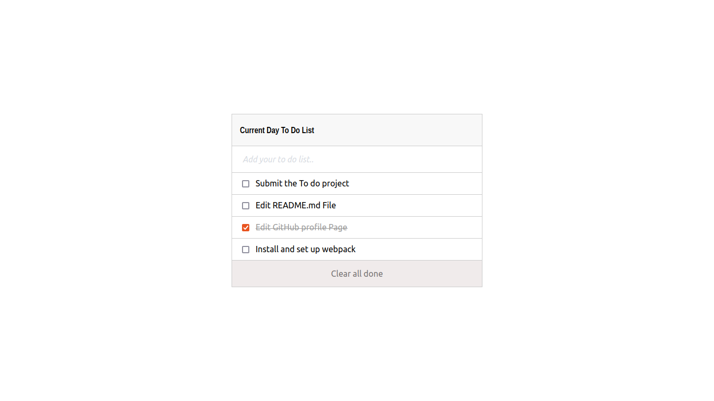

# to-do-list-app
A project based on JS DOM manipulation, modules system and Webpack in particular. 

> This is a project that displays a list of tasks which are scheduled to be done or that need to get done.
# Screenshot

# Built With

- HTML
- CSS
- DOM
- WEBPACK
- JAVASCRIPT
# Getting started

## To get a local copy of this repository kindly follow the steps below.
- Scroll to top of this current repository
- Click on the `Code` button with background color green on the right end corner
- Click on the clipboard icon on the extreme right of the dropdown to copy the repository link
- In your local PC, open your terminal or command prompt in the folder you would like to clone this repository into
- Type `git clone (copied link)` on the currently opened terminal or command prompt
- Remember to change `(copied link)` to `https://github.com/TSHEPO-CLOUD/to-do-list-app/tree/list-structure` which is the name of the repositor

## Contributors

👤 **TSHEPO DAVID MOLEFE**

- [GitHub](https://github.com/TSHEPO-CLOUD)
- [Twitter](https://twitter.com/tshepomolefem)
- [LinkedIn](https://www.linkedin.com/in/tshepo-molefe-8153313b)

## 🤝 Contributing

Contributions, issues and feature requests are welcome!

Feel free to check the [issues page](issues/).

## Show your support

Give a ⭐️ if you like this project!

